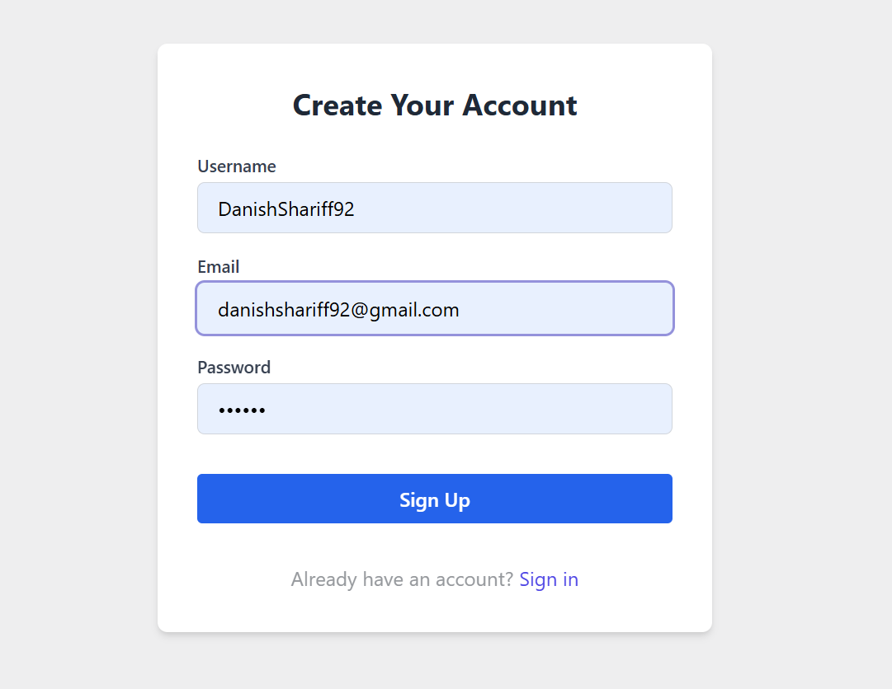
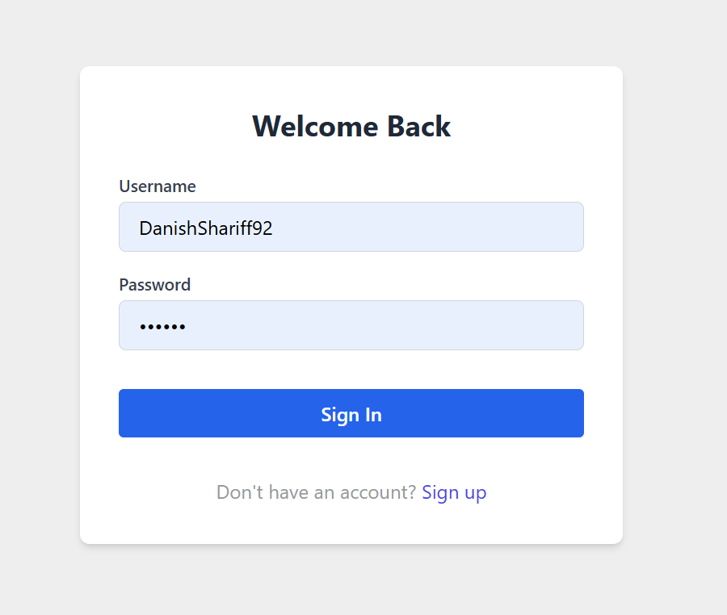
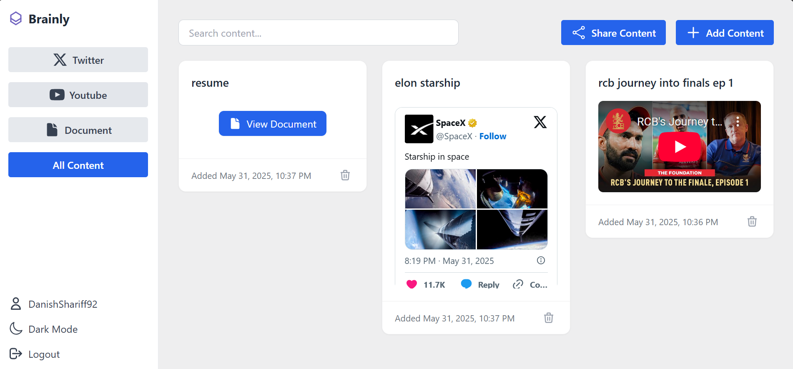
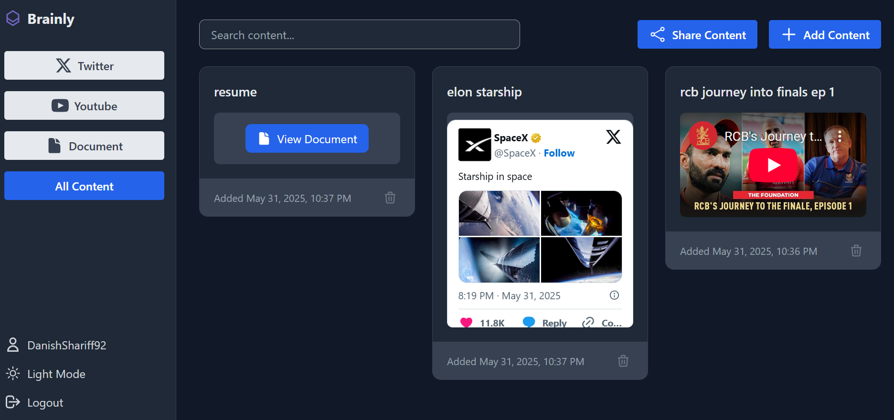
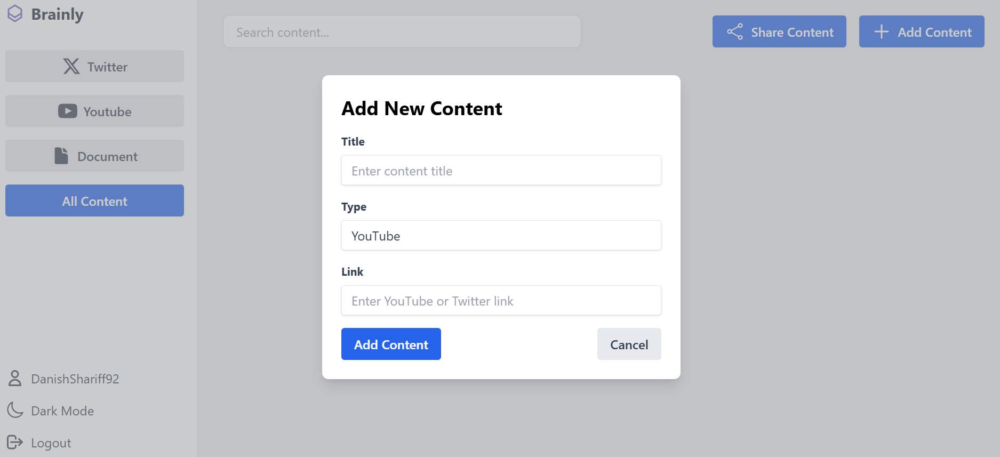
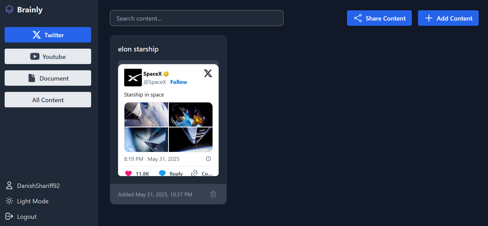
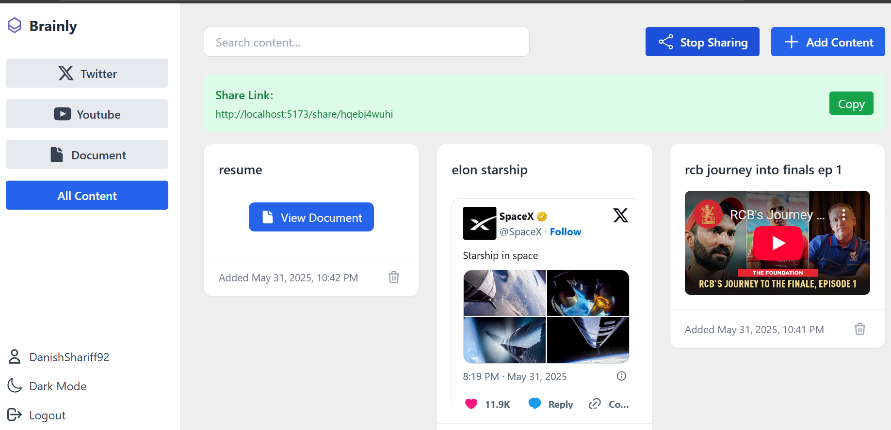
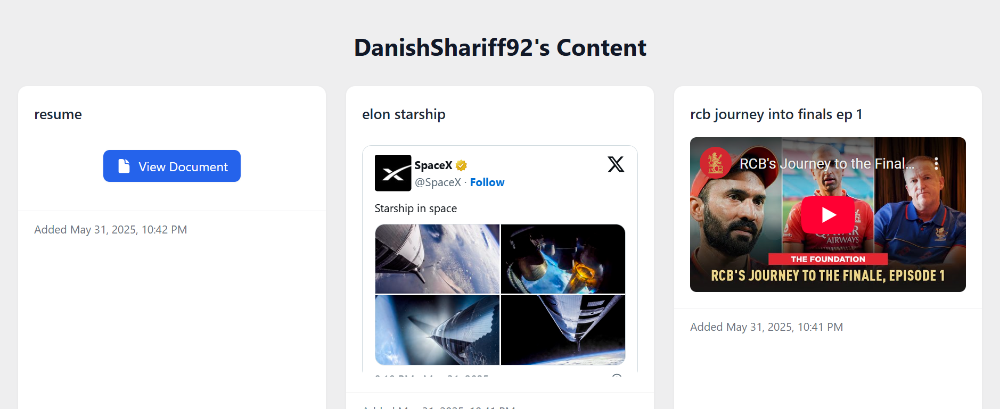
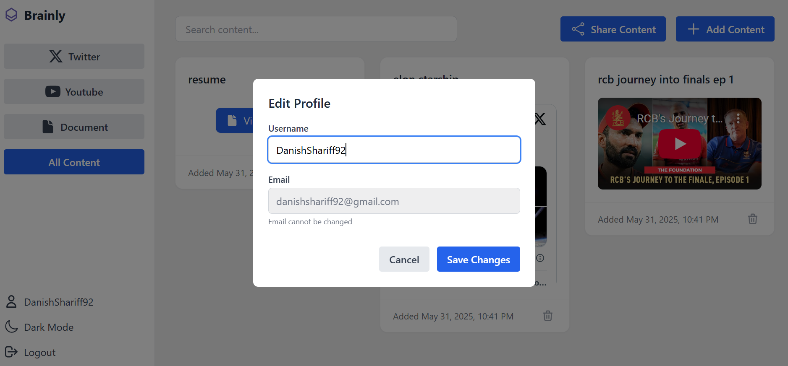

# Brainly - Your Second Brain App 🧠

Brainly is a powerful knowledge management application that helps you organize, store, and share your digital content effectively. Think of it as your second brain, where you can store everything from tweets to articles, and access them whenever you need.

## 🚀 Features

### 1. User Authentication
- **Sign Up**: Create your account with email and password
  

- **Sign In**: Secure login to access your personal dashboard
  

### 2. Modern UI with Dark Mode Support
- **Light Mode**: Clean and professional interface
  

- **Dark Mode**: Easy on the eyes with dark theme support
  

### 3. Content Management
- **Add Content**: Easily add new content cards with rich text support
  

- **Content Timeline**: Automatic date and time tracking for all content
  <!-- Timeline screenshot will be added later -->

### 4. Smart Filtering
- **Sidebar Filters**: Filter content by type (Twitter, YouTube, etc.)
  

### 5. Content Sharing
- **Share Content**: Generate shareable links for your content
  

- **Shared View**: How shared content appears to others
  

### 6. User Profile
- **Profile Card**: View and manage your profile information
  

## 🛠️ Local Development Setup

### Prerequisites
- Node.js (v16 or higher)
- npm or yarn
- Git

### Backend Setup
1. Navigate to the backend directory:
   ```bash
   cd backend
   ```

2. Install dependencies:
   ```bash
   npm install
   ```

3. Create a `.env` file with the following variables:
   ```
   PORT=5000
   MONGODB_URI=your_mongodb_uri
   JWT_SECRET=your_jwt_secret
   ```

4. Start the backend server:
   ```bash
   npm run dev
   ```

### Frontend Setup
1. Navigate to the frontend directory:
   ```bash
   cd frontend
   ```

2. Install dependencies:
   ```bash
   npm install
   ```

3. Create a `.env` file with:
   ```
   VITE_API_URL=http://localhost:5000
   ```

4. Start the development server:
   ```bash
   npm run dev
   ```

## 🏗️ Tech Stack

### MERN Stack Implementation
- **MongoDB**: NoSQL database for flexible data storage
- **Express.js**: Backend framework for robust API development
- **React**: Frontend library for dynamic user interfaces
- **Node.js**: Runtime environment for server-side execution

### Frontend
- React with TypeScript
- Vite for build tooling
- Tailwind CSS for styling
- React Context for state management
- React Router for navigation
- Axios for API calls
- React Icons for UI elements

### Backend
- Node.js with Express
- TypeScript
- MongoDB for database
- JWT for authentication
- Mongoose for ODM
- Express Validator for input validation
- Cors for cross-origin requests
- Dotenv for environment variables

## 🔒 Security Features
- JWT-based authentication
- Password hashing
- Protected routes
- Secure content sharing

## �� API Documentation

### Swagger UI Integration
The API documentation is available at `/api-docs` when running the backend server. The documentation is powered by Swagger UI, providing:

- **Interactive API Documentation**: Test API endpoints directly from the browser
- **Request/Response Examples**: View sample requests and responses for each endpoint
- **Authentication Details**: Documentation for JWT authentication flow
- **Schema Definitions**: View data models and their properties
- **API Versioning**: Track API changes and versions
- **Endpoint Categories**:
  - Authentication endpoints
  - User management endpoints
  - Content management endpoints
  - Sharing endpoints
  - Profile management endpoints

### API Features
- RESTful API design
- JSON response format
- HTTP status codes
- Error handling
- Rate limiting
- Request validation
- Response caching
- API versioning
- CORS support

## 🤝 Contributing
Contributions are welcome! Please feel free to submit a Pull Request.

## 📝 License
This project is licensed under the MIT License - see the [LICENSE](LICENSE) file for details.

## 👥 Authors
- Danish Shariff - Initial work

## 🙏 Acknowledgments
- Thanks to all contributors who have helped shape this project
- Inspired by the concept of a "Second Brain" for knowledge management 

## 📋 Complete Features List

### Authentication & User Management
- User registration with email and password
- Secure login system
- JWT-based authentication
- User profile management
- Profile customization options
- Password reset functionality
- Email verification system
- Session management
- Remember me functionality
- Auto-logout on inactivity

### Content Management
- Create and store content cards
- Rich text support for content
- Content categorization
- Content editing and deletion
- Content organization system
- Automatic date and time tracking
- Content creation history
- Last modified timestamps
- Content sharing timestamps
- Chronological content view
- Content versioning
- Content archiving
- Content tagging system
- Content search by tags
- Content export functionality

### Search & Filtering
- Real-time search functionality
- Filter content by type (Twitter, YouTube, etc.)
- Advanced search capabilities
- Quick access to recent content
- Smart content categorization
- Search history
- Search suggestions
- Filter combinations
- Sort by date, type, popularity
- Search within content

### UI/UX Features
- Modern, responsive design
- Dark/Light mode toggle
- Intuitive navigation
- Sidebar for quick access
- Mobile-friendly interface
- Loading states
- Error handling
- Success notifications
- Toast messages
- Skeleton loading
- Infinite scroll
- Pull to refresh
- Keyboard shortcuts
- Accessibility features

### Sharing Capabilities
- Generate shareable links
- Public/Private content options
- Custom sharing settings
- View shared content
- Link preview functionality
- Share to social media
- Share via email
- Share with specific users
- Share expiration
- Share analytics
- Share permissions
- Share history

### Security Features
- Password hashing
- Protected routes
- Secure content sharing
- JWT token management
- Session management
- Rate limiting
- Input sanitization
- XSS protection
- CSRF protection
- Data encryption
- Secure headers
- Audit logging

### Additional Features
- Real-time updates
- Content analytics
- User activity tracking
- Cross-platform compatibility
- Performance optimization
- Offline support
- Data backup
- Export/Import functionality
- API rate limiting
- Error tracking
- Performance monitoring
- Browser notifications
- Progressive Web App (PWA) support
- Multi-language support
- Keyboard shortcuts
- Custom themes
- Data visualization
- Activity feed
- User preferences
- System notifications 